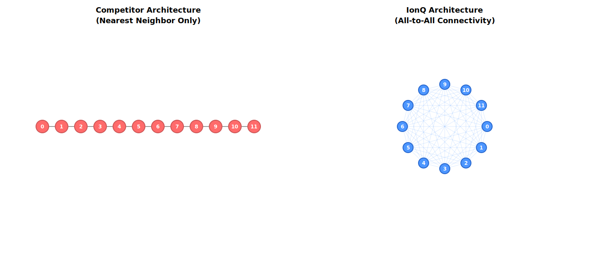

# ⚛️ IonQ Demo: Presenter Cheat Sheet

## Core Narrative: "Quality over Quantity"

**The Argument:** Other hardware may have more qubits, but IonQ qubits are *higher quality* and *better connected*. This allows us to run complex, deep algorithms (like Finance & Chemistry) that fail on "noisy" competitor chips.

---

## 🥊 Demo 1: The Technical Proof – Connectivity (QFT/Graph)

### Goal
Visually prove the "Topology Advantage" before discussing applications. This is your credibility foundation.

### The Narrative Flow

**Setup:**
> "We are running a Quantum Fourier Transform—an algorithm where every qubit talks to every other qubit."

**Competitor (Left Screen):**
> "Standard chips are like a game of 'Telephone'. Information hops neighbor-to-neighbor."

**IonQ (Right Screen):**
> "IonQ is a conference call. Everyone talks directly."

### Key Metrics to Highlight

**👉 Point at: SWAP Count**
- Competitor: High (e.g., 50+ SWAP gates)
- IonQ: **0 SWAP gates**

**👉 Point at: Circuit Depth**
- Competitor: Deep (e.g., 8-10x deeper)
- IonQ: Baseline

### The Soundbite

*"Every SWAP gate on the left is wasted energy and noise. IonQ spends zero budget on moving data around, so we spend it all on solving the problem."*

### How to Run

```bash
cd 03-Hardware-Connectivity
python connectivity_challenge.py
# Try variations:
# - n_qubits=10 (quick, clear advantage)
# - n_qubits=15 (dramatic advantage)
# - n_qubits=20 (exponential gap visible)
```

### Visual Aid
Show `figures/topology_comparison_12qubits.svg` side-by-side during the explanation.



---

## 💰 Demo 2: Finance – American Option Pricing

### Goal
Show that complex arithmetic logic is only possible with high connectivity.

### The Narrative Flow

**Setup:**
> "American Options are harder than European Options because you can exercise them at any time. This requires checking the stock price at *every* time step."

**The Problem:**
> "Each check requires a 'Comparator' circuit—heavy arithmetic logic. On a linear chip, comparing Qubit 1 (Stock Price) to Qubit 5 (Strike Price) requires a massive chain of SWAP operations."

**The Solution:**
> "IonQ's All-to-All connectivity collapses this logic into a compact, shallow circuit. We can execute this comparator 10+ times and still get clean results."

### Key Metrics to Highlight

**👉 Point at: Circuit Depth**
- Competitor: Very deep (~100+ layers per step)
- IonQ: Shallow (~30-40% reduction)

**👉 Point at: Total Gates**
- Competitor: Hundreds (due to SWAP overhead)
- IonQ: Significantly fewer

**👉 Point at: Iterations**
- Competitor: Can't afford to run comparator 10 times
- IonQ: Can run it 10+ times cleanly

### The Soundbite

*"In Finance, circuit depth equals noise. Because our circuit is 40-60% shallower, we can price the option accurately before the signal is lost to decoherence."*

### How to Run

```bash
cd 01-Finance-AmericanOptions
python finance_comparator_demo.py
# Try variations for impact:
# - num_state_qubits=4 (small advantage)
# - num_state_qubits=5 (significant advantage)
# - num_state_qubits=6 (dramatic advantage)
```

### The "Multiplication of Error" Angle

1. One comparator step is expensive on competitor hardware
2. American options require 10+ comparator steps (one per time point)
3. **Competitor:** Error multiplies → Result becomes noise
4. **IonQ:** Compact circuits stay clean even after 10+ iterations

---

## 🧪 Demo 3: Chemistry – Carbon Capture (VQE)

### Goal
Show that "Native Gates" achieve the fidelity required for real science (molecular simulation).

### The Narrative Flow

**Setup:**
> "We are simulating a molecular bond for Carbon Capture. This is the ground state energy of a CO2 molecule or metal-organic framework fragment."

**The Problem:**
> "Competitors force the entangling operation into 'CNOT' gates. It's like translating Shakespeare into binary—you lose nuance and add bloat."

**The Solution:**
> "We compile directly to IonQ's native language (Mølmer–Sørensen gates). It's physically more efficient and higher fidelity."

### Key Metrics to Highlight

**👉 Point at: 2-Qubit Gate Count**
- Competitor: High CNOT count (e.g., 40+)
- IonQ: Low MS/RXX count (e.g., 20+)

**👉 Point at: Total Circuit Depth**
- Competitor: Deep
- IonQ: Significantly shallower

**👉 Point at: Error Accumulation**
- Competitor: ~1% per CNOT × 40 gates = ~40% total error
- IonQ: ~0.1% per native gate × 20 gates = ~2% total error

### The Soundbite

*"We aren't forcing the hardware to speak our language (CNOTs). We speak the hardware's language (Mølmer–Sørensen). Fewer gates mean we maintain 'Chemical Accuracy' where others fail."*

### How to Run

```bash
cd 02-Chemistry-CarbonCapture
python chemistry_vqe_demo.py
# Try variations:
# - n_qubits=4 (baseline)
# - n_qubits=6 (noticeable advantage)
# - n_qubits=8 (dramatic advantage)
```

### Real-World Grounding

*"This isn't theoretical. IonQ has already done this with Hyundai—simulating atomic forces for carbon capture materials. That's a production use case."*

---

## 🛡️ Objection Handling

### "Can't I just use a Simulator for free?"

**Response:**
> "Simulators are perfect; reality is not. These metrics predict how the algorithm survives on *real* hardware. If the gate count is too high in simulation, it *will fail* on a real physical machine due to decoherence and error accumulation."

### "Why is IonQ slower (clock speed) than Superconducting?"

**Response:**
> "True, ions move slower than electrons microscopically. But because our circuits are *shorter* (fewer SWAPs, efficient native gates), the Time-to-Solution is often comparable. More importantly, our Probability-of-Success is much higher because we avoid the noise trap."

### "Is this accessible now?"

**Response:**
> "Yes. Everything you see here runs on Azure Quantum or Amazon Braket today via the IonQ Aria or Forte chips. You can test this in a free tier account."

### "How does this compare to X competitor's latest chip?"

**Response:**
> "Connectivity is architectural, not a scaling issue. As qubit counts grow, the connectivity problem *gets worse*—more qubits = exponentially more SWAP overhead on linear topologies. Our all-to-all approach scales better fundamentally."

---

## 📋 Pre-Presentation Checklist

- [ ] **Environment:** Python + Qiskit installed and tested
  ```bash
  python -c "from qiskit import transpile; print('✓ Qiskit OK')"
  ```

- [ ] **Test Runs:** Each script runs without errors
  - [ ] `connectivity_challenge.py` (takes ~10-30 seconds)
  - [ ] `finance_comparator_demo.py` (takes ~5-15 seconds)
  - [ ] `chemistry_vqe_demo.py` (takes ~15-60 seconds)

- [ ] **n_qubits Settings:** Pick sizes for fast execution
  - Hardware: 10 qubits (3-5 sec)
  - Finance: 5 qubits (5-10 sec)
  - Chemistry: 6 qubits (20-40 sec)

- [ ] **Display Setup:** Screen mirroring extended (not duplicated)
  - Presenter view: This cheat sheet + terminal
  - Audience view: Output metrics + visualizations

- [ ] **Backup Visuals:** Save screenshot of expected output
  - Have images ready in case live demo times out

- [ ] **Slide Deck:** SLIDE_DECK.md open in Obsidian or markdown viewer

---

## 🎬 Presentation Flow (20-30 minutes)

### Opening (2 min)
- Show topology SVG side-by-side: Linear vs. All-to-All
- Narrative: "Let me show you why architecture matters."

### Demo 1: Hardware (5-8 min)
- Run connectivity_challenge.py
- Highlight SWAP count difference
- Show scalability (optional: run n_qubits=15 to show exponential gap)
- **Soundbite:** "Quality over Quantity—we solve the hard problems."

### Demo 2: Finance (5-8 min)
- Run finance_comparator_demo.py
- Highlight circuit depth and gate savings
- Narrative: "American options need this logic 10+ times per path."
- **Soundbite:** "Shallow circuits = reliable trading."

### Demo 3: Chemistry (5-8 min)
- Run chemistry_vqe_demo.py
- Highlight 2-qubit gate count
- Show Hyundai partnership slide
- **Soundbite:** "Native gates = scientific breakthroughs."

### Closing (3-5 min)
- Recap: Connectivity, Fidelity, Real-World Impact
- Call-to-Action: "Let's run this on your use case."

---

## 💡 Pro Tips

1. **Live Demo Philosophy:** Show *output*, not code. People don't care about Python syntax; they care about metrics.

2. **Pause on Key Numbers:** When the gate count or depth difference appears, pause. Let them read it. Ask: "Notice the difference?"

3. **Emphasize the Business Implication:** Don't just say "IonQ is better." Say "Your trading desk gets reliable pricing" or "Your materials team gets real insights."

4. **Have a Backup Story:** If a script times out, switch to slides and talk through the expected output. You know the numbers.

5. **Objection Anticipation:** Tech audience will ask about error rates, decoherence, and scalability. Be ready to say: "Let's run this for 12 qubits—that's when the advantage explodes."

---

## 📞 Contact & Support

- **IonQ Hardware:** Aria (11 qubits), Forte (32 qubits available)
- **Cloud Access:** Azure Quantum, Amazon Braket
- **Documentation:** ionq.com/docs
